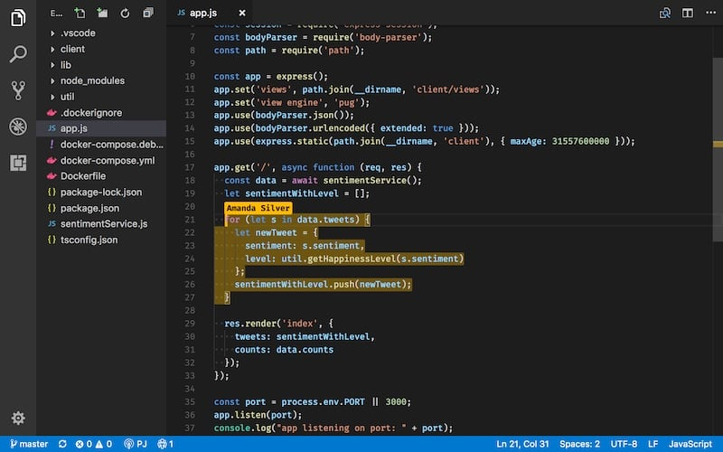
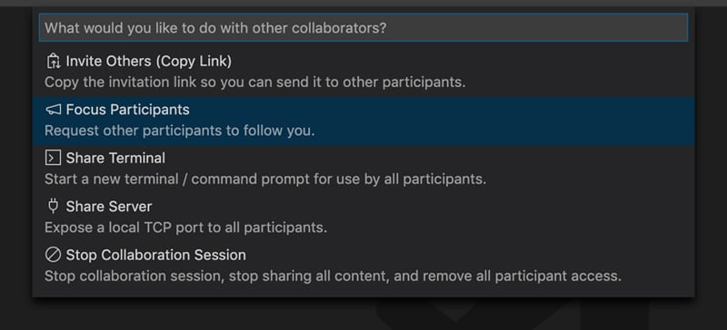
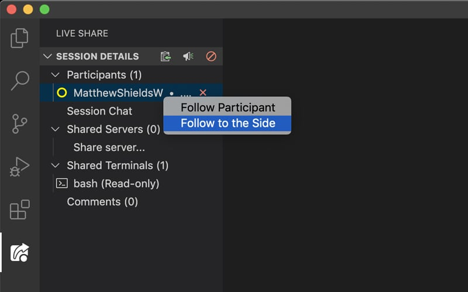
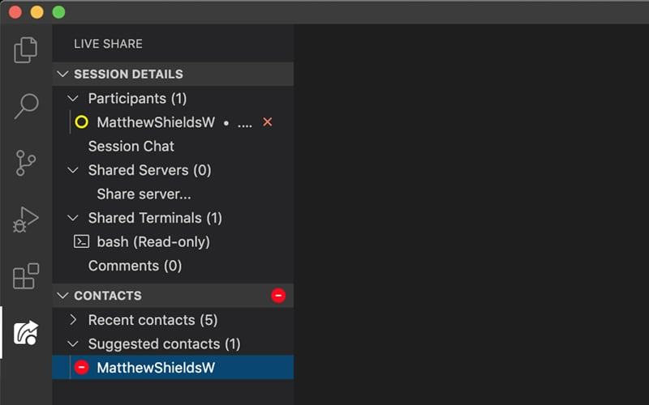

> **Requirements:** Either a Github or a Microsoft account

My development team are very close knit and the majority of us work in very close proximity of each other, like most people right now though we are all working from home. For the most part it has actually been working well, we have access to our bitbucket server and staging environments via VPN and have been able to transition pretty seamlessly.

One thing that we have noticed though, is the inability to ask another member of the team for those quick 'can you take a look at this?' moments. This is something that we regularly do to help each other, it could be that you are wondering how to approach something or having difficulty debugging a particularly tricky issue. So how do we not lose the ability to do this in the best way possible, quickly and efficiently for both parties to minimise time taken and get the problem solved?

## What was our criteria for a solution

We knew that one of our biggest criteria here was speed, the ability to have someone help you without requiring any more of their time than needed. Despite us all being helpful souls, we are of course all busy too. As a team we work on a mixture of static and CMS based work, with static pieces it can be quite quick to get up and running to take a look, but when it's a CMS issue this might require setting up on your local or even getting someone's specific database if its something they are actively working on. This is all time invested into setting up rather than helping though and still loses an aspect of looking at something collaboratively.

Having identified a few of the initial speed bumps, we set up some base criteria:

* **Speed** – the ability to quickly invite someone to help you and for them to easily assist.
* **Run from their machine** – the ability to look at it without needing to set up on your local machine.
* **Collaborative** – rather then fixing and delivering back, it should be a discussion between multiple people (ideally more than just two if needed), something that screen sharing even when someone can request control, doesn't always provide.
* **Universal** – any person in the team is able to help another.  It's no good if we are dependent on one person to provide assistance to the whole team. Every person in the team has their own expertise and we all need to be able to share this knowledge.

## Introducing the VS Code extension 'Live Share'

The whole of our development team use the editor VS Code so it works seamlessly. We find it to be absolutely fantastic and if you haven't used it before I would genuinely recommend it. If you don't though you can also get this extension for Visual Studio or even utilise it in browser, which is mind-blowing if you ask me.

What Live Share will allow you to do is allow someone to start a collaborative session and allow them to open your workspace, but in their actual editor. What this means practically is that you aren't just observing or limited to a single view, you really do have access to their project in a natural easy to use way. You can both explore different files, run terminal sessions, commit to git with automatic co-author comments; and all whilst still being natural to them by having their own VS Code themes.

> **Criteria met:** Speed, Run from their machine, Universal

## Some of our favourite features

We are still quite new to this being part of our development process, so don't take this as an exhaustive list of every feature that it has, for that you may have to do some exploring yourself. For us though these are the features that we are most excited about for us working together.

### User cursors

Unsurprisingly, if you are bringing multiple people into editing a file at the same time, you will need to be able to differentiate between them. Live Share manages to do this in a way that works really well, between the differing colours and use of labels. We are yet to have any issues with it, and although its not the most advanced feature without this being refined I think the rest may have fallen flat.

> **Criteria met:** Speed

### Focus participants

I have previously said that one of the great things about Live Share is the ability to move around the project independently (and it really is great for when it comes to exploring the issue) but what about when you want to explain the issue or (hopefully) explain the solution? When you want to do that, anybody partaking in the session will have the ability to use the 'Focus Participants' command. When this is used it will bring everyone to the part of the file that the person who runs it is looking at, even following them as they move around it or between files.

> **Criteria met:** Collaborative

### Follow to the side

You can also choose to follow a participant at any time rather than them making the call out themselves. Another option you get at this time is 'Follow to the side', if you use this feature then a split screen will be initiated where one side is for you whilst the other follows them. I believe you would call this the best of both worlds if you are figuring something out together.

> **Criteria met:** Collaborative

### Audio Chat / Text Chat

We already have plenty of options for talking to each other remotely; Slack, Microsoft Teams, Google Hangouts, Skype or an actual phone call, there are more options than you could ever need to do this. But why should you need to bring another application into the mix? You can actually open up an audio chat within Live Share to talk through the issue as you work. Is audio chat not your thing or you're in a public place where it's not appropriate? No worries, Live Share has your back and will also provide a chat window for you all to communicate. Whatever works for you!

> **Criteria met:** Collaborative

### Contacts / Link Share

You are probably going to be running sessions with a limited group of people for the most part, namely members of your team. You have the ability to add contacts to your Live Share list, after you have done that you will be able to initiate sessions with specific people instantly. What about if you want to share with someone that you haven't got in your contacts list? No worries they can join through a simple URL that will be automatically copied into your clipboard when you start a session.

A nice addition to this is also that if you have been in a session with someone before they will be added to your contacts list, making it super easy if you need to pick something back up with a specific person. Easy!

> **Criteria met:** Speed

## But what about viewing it in the browser?

One of our criteria was the ability to have it running completely from the session creators machine, without any setup required on the part of the participant's machines. Everything above is amazing, but what about actually being able to see the site in your browser? It would be hard to know sometimes if your fix has worked if you can't actually see it wouldn't it.

Initially we started by simultaneously sharing the persons screen on Microsoft Teams at the same time, however this felt like we weren't really achieving what we set out to do. It still required you to instruct the other person to refresh and users couldn't both control the browser independently, this was an issue.

We quickly shifted from using this approach and moved to using ngrok to create a localtunnel to our local environments. This meant that we could, within seconds, create a publicly accessible link that we could share with anybody in the team, allowing both independent control of the browsers and an efficient work flow to help each other. This solution was really simple for when we were working with static sites, however there was a bit more to figure out when it came to WordPress sites. We are really happy with the results of this though and think is going to help us with any remote debugging in the future.

I have written up guides to both solutions though for you to take a look at if you want, links are at the [bottom of the article](#related-links).

> **Criteria met:** Speed, Run from their machine, Universal

## Conclusion

Through a combination of using Live Share and ngrok we have been able to help each other, something that we are really passionate about as a team. At this point, we don't know how long we will be working from home, but this set up has taken one more challenge away from us. Even when we aren't though, I think our relationship with the idea of remote working will be fundamentally changed. If you have a team I would highly recommend that you think about what you can do to make it work as easily as possible for everyone.

I think you can tell from this post that I am blown away by the Live Share extension if you are looking for something to try I couldn't recommend this enough. If you have any ideas of improvements we can make please also reach out to me on <a href="https://twitter.com/MattShieldsDev" target="_blank">Twitter</a>, I would love to hear them.

## Shoutout

I would be amiss to not give a big shoutout goes to <a href="https://twitter.com/LostInTangent" target="_blank">Jonathan Carter</a>, the creator of this extension, and so the person who is allowing my team to be able to work together so well at this difficult time. I first came across this extension when it was in beta and he was nice enough to share an invite with me, however I didn't get the full benefits at the time until we were working remotely. A genuine thanks to you!

## Related Links

* <a href="https://marketplace.visualstudio.com/items?itemName=MS-vsliveshare.vsliveshare-pack" target="_blank">Live Share Extension</a>
* [Guide to sharing local WordPress sites remotely using ngrok](/sharing-local-wordpress-sites-remotely-using-ngrok)
* [Guide to sharing local static sites remotely using ngrok](/sharing-local-static-sites-remotely-using-ngrok)